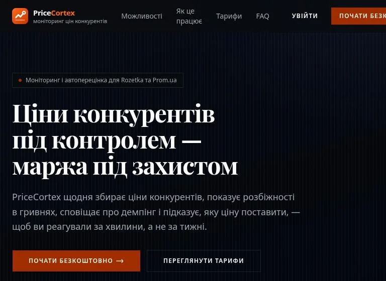
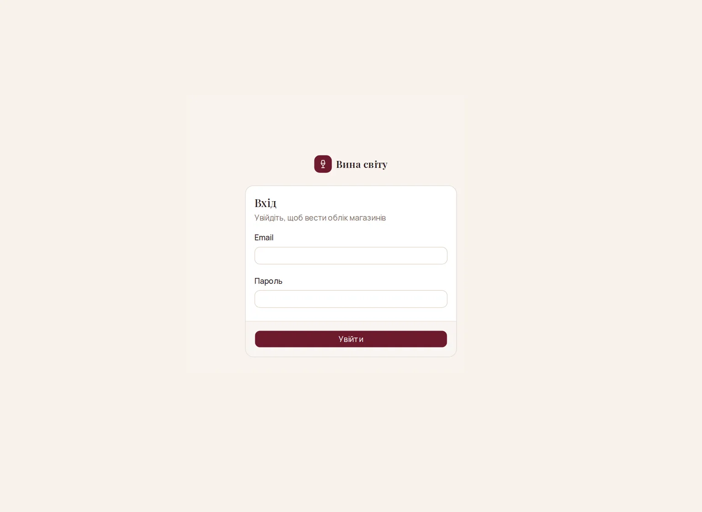
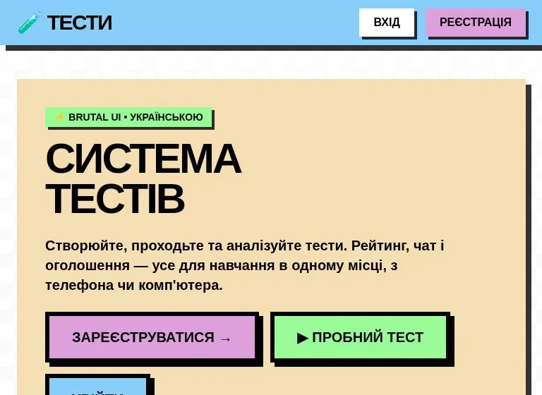
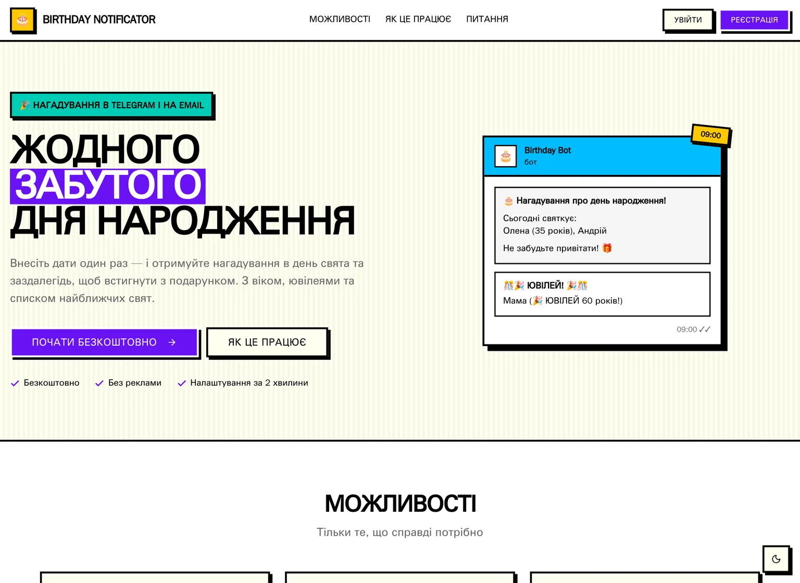
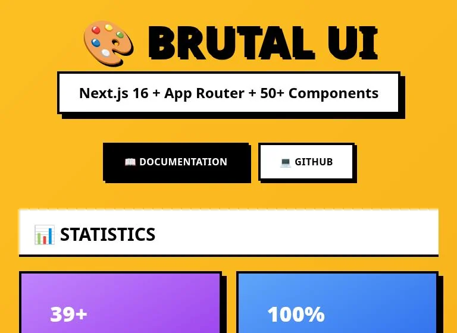
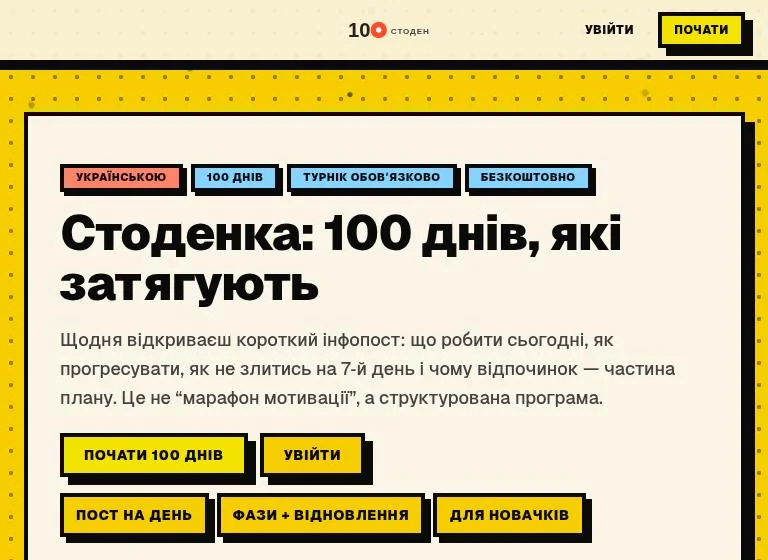
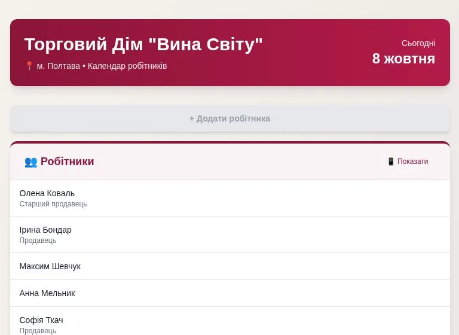

# Artem Makarenko

**Full-stack developer · Next.js, TypeScript, Postgres**

I build web products that businesses use every day: price monitoring for marketplace sellers, payroll and accounting for a chain of stores, a testing platform. I take them from idea to production, including the server side, automation and self-hosted infrastructure.

🌐 [rollandss.github.io](https://rollandss.github.io/) · [Українська версія](README.uk.md)

## Products in production

### PriceCortex

B2B SaaS that tracks competitor prices on Rozetka and Prom.ua for online sellers.

- Daily price collection runs in n8n with FlareSolverr on a Hetzner server
- Dumping alerts, pricing rules and auto-repricing through the marketplace Seller API
- AI-assisted matching of analog products; seller API credentials encrypted with AES-256-GCM
- Team roles, paid plans via LiqPay, 24 test files covering pricing and repricing logic

**Stack:** Next.js 16, React 19, Tailwind 4, shadcn/ui, Neon Postgres, NextAuth v5, n8n, OpenAI, LiqPay, Vitest  
[Open live](https://www.pricecortex.com) · Private repo, code on request

### Oblik Stores

Accounting app for a chain of wine stores: payroll, cash income and staff schedules.

- Each employee's pay is calculated from their shift schedule, rate and bonuses
- Month closing, change log with restore, automatic backups by email
- Payroll sheets and statistics export to Excel; store expenses can be added from a Telegram bot
- Tests run during the Vercel build, so a broken calculation never reaches production

_Internal tool with real business data, so the screenshot shows only the sign-in page._

**Stack:** Next.js 16, Better Auth, Drizzle ORM, Turso, ExcelJS, Resend, Telegram Bot API, Vitest  
[Open live](https://oblik-stores.vercel.app) · Private repo, code on request

### Tests System

Platform for creating and taking tests, with roles for students, teachers and admins.

- Random question selection, autosaved progress and detailed result analysis
- Test import from Word and PDF files
- Top-5 rating, chat rooms and announcements
- Rate limiting, input validation, security headers and error monitoring with Sentry

**Stack:** Next.js 16, Prisma, Neon Postgres, Upstash Redis, Sentry, Zod, Brutal UI  
[Open live](https://tests-system-vert.vercel.app) · Private repo, code on request

### Birthday Notificator

Birthday reminders in Telegram and by email, set up once.

- Connect a shared bot in one click or plug in your own Telegram bot
- Reminders 1, 3 or 7 days ahead, grouped into one daily digest
- CSV import and export, per-user API keys, each user picks the hour of delivery
- Bot tokens encrypted with AES-256-GCM; repeated cron calls are safe

**Stack:** Next.js 16, NextAuth v5, Upstash Redis, Resend, Telegram Bot API, react-hook-form  
[Open live](https://notificator-lake.vercel.app) · Private repo, code on request

## Smaller projects

| | |
|---|---|
|  | **Brutal UI** Neobrutalist React component library: 39 typed components with a demo site. Used in Tests System. React, TypeScript, Tailwind CSS, Next.js [Open live](https://brutal-ui-one.vercel.app) · [Source code](https://github.com/rollandss/brutal-ui) |
|  | **Stodenka** 100-day pull-up bar program: a short daily post, workout log with sets and reps, and an admin editor for posts. Next.js 16, Prisma, Postgres, TipTap, jose [Open live](https://training-olive-three.vercel.app) · [Source code](https://github.com/rollandss/training) |
|  | **Staff Calendar** First version of the shift calendar for the wine store chain, with notes and PDF export. Later grew into Oblik Stores. Names in the screenshot are replaced. Next.js, PDF export |

## What I work with

- **Frontend:** React 19, Next.js 16 (App Router, Server Actions), TypeScript, Tailwind CSS, shadcn/ui
- **Backend & data:** Postgres (Neon), Prisma, Drizzle, Turso/libSQL, Redis (Upstash), Zod
- **Auth & payments:** NextAuth v5, Better Auth, JWT, LiqPay
- **Automation:** n8n, Telegram bots, cron jobs, email via Resend
- **Infrastructure:** Vercel, Hetzner, Docker, Tailscale, Linux (Arch)
- **Quality:** Vitest, ESLint, Sentry, rate limiting, AES-256-GCM for stored secrets

<picture>
  <source media="(prefers-color-scheme: dark)" srcset="https://raw.githubusercontent.com/rollandss/rollandss/output/github-snake-dark.svg">
  
</picture>
