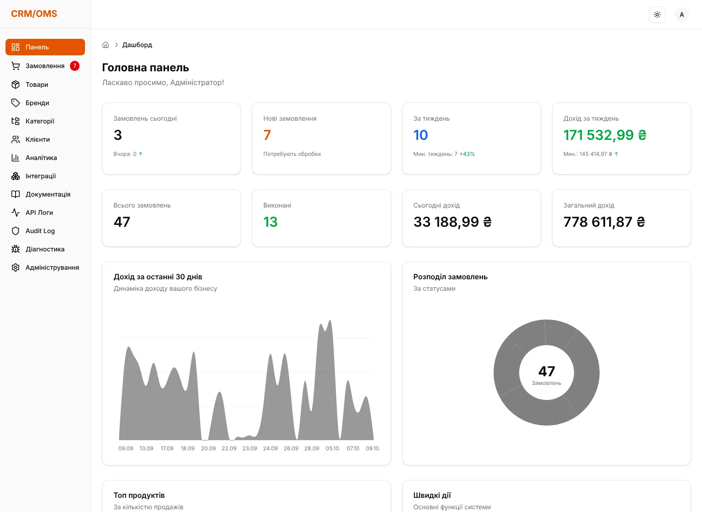
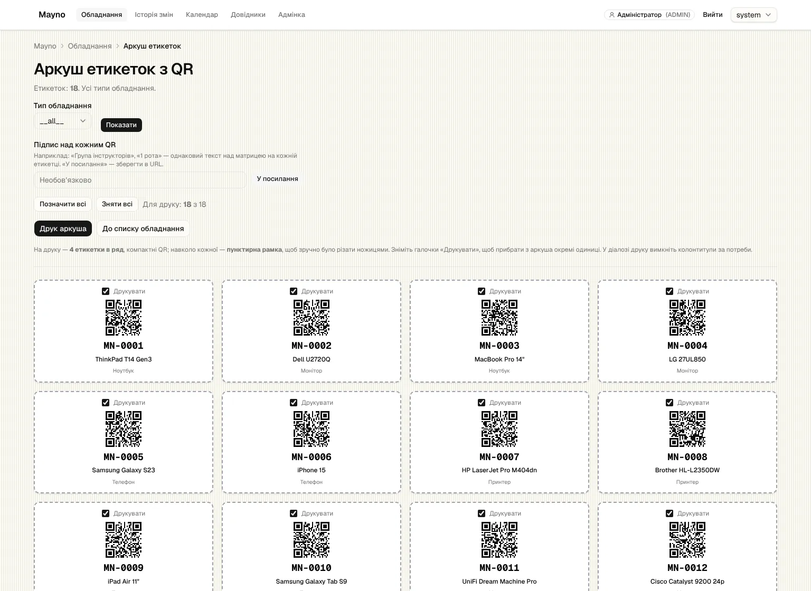

# Артем Макаренко

Роблю вебпродукти, якими бізнес користується щодня: моніторинг цін для продавців на маркетплейсах, облік зарплат і приходів для мережі магазинів, систему тестування. Веду їх від ідеї до продакшену, разом із серверною частиною, автоматизацією й власною інфраструктурою.

🌐 [rollandss.github.io](https://rollandss.github.io/uk/) · [English version](README.md)

## Продукти в продакшені

### PriceCortex

B2B SaaS, що відстежує ціни конкурентів на Rozetka та Prom.ua для інтернет-продавців.

- Щоденний збір цін працює в n8n з FlareSolverr на сервері Hetzner
- Тривоги про демпінг, правила ціноутворення й автоперецінка через Seller API маркетплейсу
- AI-пошук аналогів; доступи до Seller API зашифровані AES-256-GCM
- Ролі в команді, тарифи з оплатою через LiqPay, понад 200 unit-тестів для логіки цін і перецінки

**Стек:** Next.js 16, React 19, Tailwind 4, shadcn/ui, Neon Postgres, NextAuth v5, n8n, OpenAI, LiqPay, Vitest  
[Відкрити](https://www.pricecortex.com) · Приватний репозиторій, код на запит

### Oblik Stores

Облік для мережі винних магазинів: зарплати, приходи коштів і графіки роботи.

- Зарплата кожного працівника рахується з графіка змін, ставки й бонусів
- Закриття місяця, журнал змін з відновленням, автоматичні резервні копії на пошту
- Відомості на виплату й статистика в Excel; витрати магазинів можна вносити з Telegram-бота
- Тести запускаються під час збірки на Vercel, тож зламаний розрахунок не потрапить у продакшен

_Внутрішній інструмент з реальними даними бізнесу, тому на скріншоті лише сторінка входу._

**Стек:** Next.js 16, Better Auth, Drizzle ORM, Turso, ExcelJS, Resend, Telegram Bot API, Vitest  
[Відкрити](https://oblik-stores.vercel.app) · Приватний репозиторій, код на запит

### Tests System

Платформа для створення й проходження тестів з ролями для учнів, викладачів і адмінів.

- Випадковий вибір питань, автозбереження прогресу й детальний аналіз результатів
- Імпорт тестів з файлів Word і PDF
- Рейтинг топ-5, чат-кімнати й оголошення
- Rate limiting, валідація вводу, security-заголовки й моніторинг помилок через Sentry

**Стек:** Next.js 16, Prisma, Neon Postgres, Upstash Redis, Sentry, Zod, Brutal UI  
[Відкрити](https://tests-system-vert.vercel.app) · Приватний репозиторій, код на запит

### Birthday Notificator

Нагадування про дні народження в Telegram і на email, налаштовані один раз.

- Спільний бот підключається одним кліком, або можна додати власного Telegram-бота
- Нагадування за 1, 3 чи 7 днів одним дайджестом на день
- Імпорт і експорт CSV, API-ключі для кожного користувача, вибір години сповіщень
- Токени ботів зашифровані AES-256-GCM; повторні виклики cron безпечні

**Стек:** Next.js 16, NextAuth v5, Upstash Redis, Resend, Telegram Bot API, react-hook-form  
[Відкрити](https://notificator-lake.vercel.app) · Приватний репозиторій, код на запит

## Менші проєкти

| | |
|---|---|
|  | **Brutal UI** Бібліотека React-компонентів у стилі необруталізму: 39 типізованих компонентів і демо-сайт. Використана в Tests System. React, TypeScript, Tailwind CSS, Next.js [Відкрити](https://brutal-ui-one.vercel.app) · [Код](https://github.com/rollandss/brutal-ui) |
|  | **Stodenka** Програма тренувань на турніку на 100 днів: короткий пост на кожен день, лог підходів і повторів, адмінка з редактором постів. Next.js 16, Prisma, Postgres, TipTap, jose [Відкрити](https://training-olive-three.vercel.app) · [Код](https://github.com/rollandss/training) |
|  | **CRM для e-commerce** Замовлення, товари, клієнти й доставка для інтернет-магазину. Підтягує замовлення з Prom.ua і Rozetka, створює відправлення Новою поштою, Укрпоштою й Meest, аналітика продажів, 2FA і журнал дій. Next.js 16, Prisma, Postgres, NextAuth + TOTP, Recharts, Jest Приватний репозиторій, код на запит |
|  | **Mayno** Облік обладнання: таблиця з пошуком і фільтрами в URL, друк QR-етикеток, що відкривають картку предмета, історія змін із календарем, вигрузка в Excel. Next.js 16, Prisma, SQLite, Auth.js, TanStack Table, Vitest, Playwright Приватний репозиторій, код на запит |
|  | **Staff Calendar** Перша версія календаря змін для мережі винних магазинів, з нотатками й експортом у PDF. Згодом переросла в Oblik Stores. Імена на скріншоті замінені. Next.js, PDF export |

## З чим працюю

- **Фронтенд:** React 19, Next.js 16 (App Router, Server Actions), TypeScript, Tailwind CSS, shadcn/ui
- **Бекенд і дані:** Postgres (Neon), MongoDB, Prisma, Drizzle, Turso/libSQL, Redis (Upstash), Zod
- **Авторизація й оплати:** NextAuth v5, Better Auth, JWT, LiqPay
- **Автоматизація:** n8n, Telegram-боти, cron, email через Resend
- **Інфраструктура:** Vercel, Hetzner, Docker, Tailscale, Linux (Arch)
- **Якість:** Vitest, ESLint, Sentry, rate limiting, AES-256-GCM для збережених секретів

## Звʼязатися

[GitHub](https://github.com/rollandss) · [Facebook](https://www.facebook.com/makar.artemenko) · [Instagram](https://www.instagram.com/rollandss05/)

<picture>
  <source media="(prefers-color-scheme: dark)" srcset="https://raw.githubusercontent.com/rollandss/rollandss/output/github-snake-dark.svg">
  
</picture>
